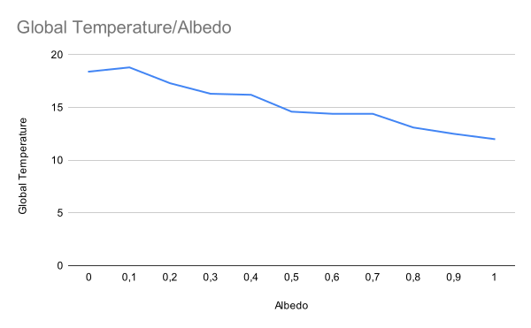
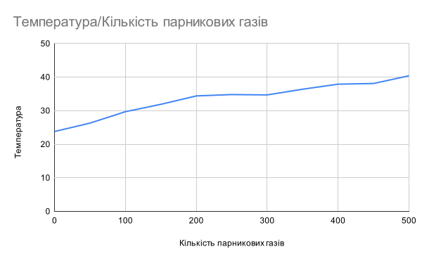
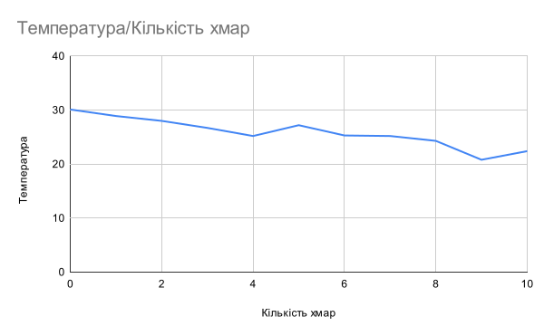

## Комп'ютерні системи імітаційного моделювання
## СПм-22-4, **Бешта Вячеслав Сергійович**
### Лабораторна робота №**1**. Опис імітаційних моделей та проведення обчислювальних експериментів

 

### Варіант 2, модель у середовищі NetLogo:
[Climate Change](https://www.netlogoweb.org/launch#http://www.netlogoweb.org/assets/modelslib/Sample%20Models/Earth%20Science/Climate%20Change.nlogo)

 

### Вербальний опис моделі:
Це модель потоку енергії в Землі, зокрема теплової енергії. На ній Земля зображена рожевим кольором, а поверхня планети - чорною смугою. Над смугою - блакитна атмосфера, а вгорі - чорний космос. До атмосфери можна додати хмари та молекули вуглекислого газу (CO2). Молекули CO2 є парниковими газами, які блокують інфрачервоне світло, що випромінюється Землею. Хмари затримують вхідні та вихідні сонячні промені, впливаючи на нагрівання або охолодження планети.

### Керуючі параметри:
- **sun-brightness** - Цей параметр регулює кількість сонячної енергії, що потрапляє в атмосферу Землі.
- **albedo** - Цей параметр контролює, яка частина сонячної енергії, що потрапляє на землю, поглинається.
- **clouds** - Цей папрметр контролює кількість хмар. Хмари блокують сонячне світло, але не інфрачервоне.
- **CO2** - Цей папрметр контролює кількість парникових газів. CO2 блокує інфрачервоне світло, але не сонячне.

### Внутрішні параметри:
- **sky-top** - Цей параметр визначає Y координату верхнього рядка неба.
- **earth-top** - Цей параметр визначає Y координату верхнього ряду землі.
- **temperature** - Цей параметр відображає загальну температуру.
- **ray** - Цей параметр визначає промені сонячного світла.
- **IR** - Цей параметр визначає інфрачервоне випромінювання.
- **heat** - Цей параметр визначає кількість теплової енергії.

### Показники роботи системи:
- **Global Temperature** - графік температури Землі.

### Недоліки моделі:
В реальному житті поверхня землі не ідеально рівна. Модель зосереджена на впливі CO2, але інші парникові гази, такі як метан чи водяна пара, не враховані. Модель не враховує географічні та топографічні особливості, такі як гори, великі океани чи різноманіття ґрунтів, які можуть впливати на розподіл енергії.

 

## Обчислювальні експерименти

### 1. Вплив альбедо на температуру
Досліджується залежність росту температури Землі протягом певної кількості тактів (1000) від коефіцієнта альбедо. Експерименти проводяться при 0-1 значення альбедо, з кроком 0.1, усього 11 симуляцій.  
Інші керуючі параметри мають значення за замовчуванням:
- **sun-brightness**: 1
- **clouds**: 0
- **С02**: 0

<table>
<thead>
<tr><th>Коефіцієнт альбедо</th><th>Температура</th></tr>
</thead>
<tbody>
<tr><td>0</td><td>18,4</td></tr>
<tr><td>0.1</td><td>18,8</td></tr>
<tr><td>0.2</td><td>17,3</td></tr>
<tr><td>0.3</td><td>16,3</td></tr>
<tr><td>0.4</td><td>16,2</td></tr>
<tr><td>0.5</td><td>14,6</td></tr>
<tr><td>0.6</td><td>14,4</td></tr>
<tr><td>0.7</td><td>14,4</td></tr>
<tr><td>0.8</td><td>13,1</td></tr>
<tr><td>0.9</td><td>12,5</td></tr>
<tr><td>1</td><td>12,0</td></tr>
</tbody>
</table>

З результатів видно, що зменшення альбедо призводить до збільшення температури. Із зростанням коефіцієнта альбедо (від 0 до 1) спостерігається зменшення температури Землі. Це підтверджує важливість альбедо як фактора, що впливає на енергетичний баланс планети.

### 2. Вплив парникових газів на температуру
Досліджується залежність росту температури Землі протягом певної кількості тактів (10000) від кількості парникових газів. Експерименти проводяться при 0-500 значення CO2, усього 11 симуляцій.  
Інші керуючі параметри мають значення за замовчуванням:
- **albedo**: 0.6
- **sun-brightness**: 1
- **clouds**: 0

<table>
<thead>
<tr><th>Кількість парникових газів</th><th>Температура</th></tr>
</thead>
<tbody>
<tr><td>0</td><td>23,8</td></tr>
<tr><td>50</td><td>26,3</td></tr>
<tr><td>100</td><td>29,7</td></tr>
<tr><td>150</td><td>31,9</td></tr>
<tr><td>200</td><td>34,4</td></tr>
<tr><td>250</td><td>34,8</td></tr>
<tr><td>300</td><td>34,7</td></tr>
<tr><td>350</td><td>36,4</td></tr>
<tr><td>400</td><td>37,9</td></tr>
<tr><td>450</td><td>38,1</td></tr>
<tr><td>500</td><td>40,4</td></tr>
</tbody>
</table>

З результатів видно, що збільшення кількості CO2 призводить до збільшення теплового ефекту та підвищення температури, що підкреслює важливість обмеження викидів CO2 для збереження кліматичної стабільності.

### 3. Вплив хмар на температуру
Досліджується залежність росту температури Землі протягом певної кількості тактів (10000) від кількості хмар. Експерименти проводяться при 0-10 значення хмар, з кроком 1, усього 11 симуляцій.  
Інші керуючі параметри мають значення за замовчуванням:
- **albedo**: 0.6
- **sun-brightness**: 1
- **CO2**: 100

<table>
<thead>
<tr><th>Кількість хмар</th><th>Температура</th></tr>
</thead>
<tbody>
<tr><td>0</td><td>30,1</td></tr>
<tr><td>1</td><td>28,9</td></tr>
<tr><td>2</td><td>28,0</td></tr>
<tr><td>3</td><td>26,7</td></tr>
<tr><td>4</td><td>25,2</td></tr>
<tr><td>5</td><td>27,2</td></tr>
<tr><td>6</td><td>25,3</td></tr>
<tr><td>7</td><td>25,2</td></tr>
<tr><td>8</td><td>24,3</td></tr>
<tr><td>9</td><td>20,8</td></tr>
<tr><td>10</td><td>22,4</td></tr>
</tbody>
</table>

З результатів видно, що зміни в характеристиках хмар можуть впливати на енергетичний баланс Землі, що має ключове значення для прогнозування кліматичних змін. Загалом, із збільшенням кількості хмар спостерігається зниження температури, але цей ефект неоднаковий і може бути залежний від інших факторів.

 

