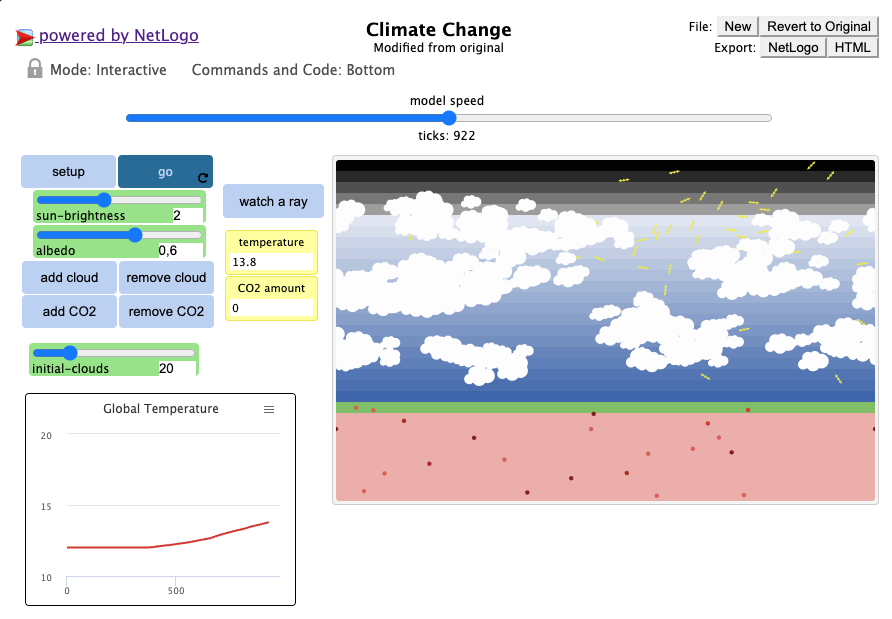
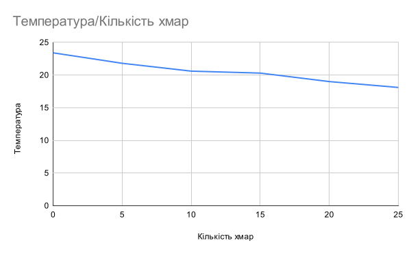

## Комп'ютерні системи імітаційного моделювання
## СПм-22-4, **Бешта Вячеслав Сергійович**
### Лабораторна робота №**1**. Опис імітаційних моделей та проведення обчислювальних експериментів

 

### Варіант 2, модель у середовищі NetLogo:
[Climate Change](https://www.netlogoweb.org/launch#http://www.netlogoweb.org/assets/modelslib/Sample%20Models/Earth%20Science/Climate%20Change.nlogo)

 

### Внесені зміни у вихідну логіку моделі, за варіантом:

**Додати можливість вказівки початкової кількості хмар:**

Додано слайдер, який дозволяє користувачеві змінювати початкову кількість хмар:

Додано процедуру `create-initial-clouds`,що викликає процедуру `add-cloud` вказану в initial-clouds слайдері кількість разів:
<pre>
to create-initial-clouds 
  repeat initial-clouds 
  [ add-cloud ]
end
</pre>

виклик `create-initial-clouds` додано до `setup` процедури:
<pre>
to setup
  ...
  create-initial-clouds  ;; create initial amount of clouds
  reset-ticks
end
</pre>

**Додати зміну кута падіння нових сонячних промінів протягом часу (це дозволить імітувати зміну положення сонця протягом доби):**

Додано глобальну змінну sun-angle, що відповідаме куту сонця відносно поверхні Землі.
<pre>
globals [
    ...
    sun-angle    ;; angle of the sun
  
    min-day-sun-angle
    max-day-sun-angle
]
</pre>

вказані мінімальний та максимальний кут нахилу Cонця відносно Землі:
<pre>
setup 
    ...  
    set min-day-sun-angle -65
    set max-day-sun-angle 65
    
    set sun-angle min-day-sun-angle  ;; set your desired initial angle of the sun
end
</pre>

Додано процедуру на зміну кута сонця:
<pre>
to update-sun-angle 
  ifelse sun-angle > max-sun-angle
  [set sun-angle min-sun-angle]
  [set sun-angle sun-angle + 1]
end
</pre>

Модифіковано `create-sunshine` процедуру. До початкового кута додано змінну sun-angle, координата Сонця по осі X змінено на вираз `(random -10) + sun-angle / 3` для симуляції переміщення протягом дня.
<pre>
to create-sunshine 
  ;; don't necessarily create a ray each tick
  ;; as brightness gets higher make more
  if 10 * sun-brightness > random 50 [
    create-rays 1 [
      set heading 160 + sun-angle  ;; angle of rays
      set color yellow
      ;; rays only come from a small area
      ;; near the top of the world
      setxy (random -10) + sun-angle / 3 max-pycor ;; movement of the sun
    ]
  ]
end
</pre>

Фінальний код моделі та її інтерфейс доступні за [посиланням](Climate_Change.nlogo).

 

### Внесені зміни у вихідну логіку моделі, на власний розсуд:

**Додано симуляцію темного часу доби, коли ділянка землі не отримує сонячних променів, а отримане тепло продовжує випромінюватися.**

Додано глобальні змінні кутів Сонця відносно землі для темного часу доби.
<pre>
globals [
  ...

  min-night-sun-angle 
  max-night-sun-angle
  ...
]
</pre>

<pre>
setup
  ...

  set min-night-sun-angle 66
  set max-night-sun-angle 195
  ...
</pre>

В процедурі `update-sun-angle` збільшено діапазон куту Сонця для симуляції ночі:
<pre>
to update-sun-angle 
  ifelse sun-angle > max-night-sun-angle
  [set sun-angle min-day-sun-angle]
  [set sun-angle sun-angle + 1]
end
</pre>

В процедурі `run-sunshine` змінено частоту виклику `create-sunshine`, тепер генерація сонячних променів відбувається при світлій частині доби. 
<pre>
to run-sunshine
  ...
  if sun-angle > min-day-sun-angle and sun-angle < max-day-sun-angle
  [create-sunshine]  ;; create new sun rays from top while day
end
</pre>

В процедурі `run-heat` змінено частоту виділення інфрачервоного випромінювання, тепер воно може відбуватися при будь-якій температурі, а не тільки при значеннях, що більше 20.

<pre>
to run-heat    ;; advances the heat energy turtles
  ;; the temperature is related to the number of heat turtles
  set temperature 0.99 * temperature + 0.01 * (12 + 0.1 * count heats)
  ask heats
  [
    let dist 0.5 * random-float 1
    ifelse can-move? dist
      [ fd dist ]
      [ set heading 180 - heading ] ;; if we're hitting the edge of the world, turn around
    if ycor >= earth-top [  ;; if heading back into sky
      ifelse 10 > random 20 ;; <-- changes
              ;; heats only seep out of the earth from a small area
              ;; this makes the model look nice but it also contributes
              ;; to the rate at which heat can be lost
              and xcor > 0 and xcor < max-pxcor - 8
        [ set breed IRs                    ;; let some escape as IR
          set heading 20
          set color magenta ]
        [ set heading 100 + random 160 ] ;; return them to earth
    ]
  ]
end
</pre>

## Обчислювальні експерименти
### 1. Вплив хмар на температуру
Досліджується залежність росту температури Землі протягом певної кількості тактів (10000) від кількості хмар. Експерименти проводяться при 0-25 значення хмар, з кроком 5, усього 6 симуляцій.  
Інші керуючі параметри мають значення:
- **albedo**: 0.6
- **sun-brightness**: 1
- **CO2**: 100

<table>
<thead>
<tr><th>Кількість хмар</th><th>Температура</th></tr>
</thead>
<tbody>
<tr><td>0</td><td>24,8</td></tr>
<tr><td>5</td><td>20,9</td></tr>
<tr><td>10</td><td>18,7</td></tr>
<tr><td>15</td><td>16,1</td></tr>
<tr><td>20</td><td>15,2</td></tr>
<tr><td>25</td><td>13,7</td></tr>
</tbody>
</table>

Графік наочно показує, що із збільшенням кількості хмар глобальна температура зменшується.

 
