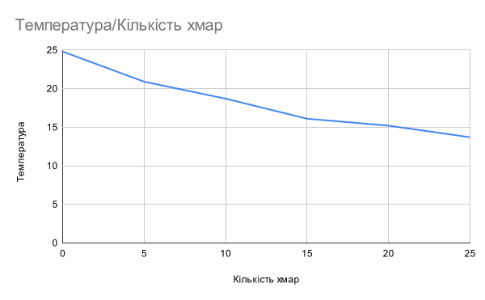

## Комп'ютерні системи імітаційного моделювання
## СПм-22-4, **Бешта Вячеслав Сергійович**
### Лабораторна робота №**1**. Опис імітаційних моделей та проведення обчислювальних експериментів

 

### Варіант 2, модель у середовищі NetLogo:
[Climate Change](https://www.netlogoweb.org/launch#http://www.netlogoweb.org/assets/modelslib/Sample%20Models/Earth%20Science/Climate%20Change.nlogo)

 

### Внесені зміни у вихідну логіку моделі, за варіантом:

**Додати можливість вказівки початкової кількості хмар:**

Додано слайдер, який дозволяє користувачеві змінювати початкову кількість хмар:

Додано процедуру `create-initial-clouds`,що викликає процедуру `add-cloud` вказану в initial-clouds слайдері кількість разів:
<pre>
to create-initial-clouds 
  repeat initial-clouds 
  [ add-cloud ]
end
</pre>

виклик `create-initial-clouds` додано до `setup` процедури:
<pre>
to setup
  ...
  create-initial-clouds  ;; create initial amount of clouds
  reset-ticks
end
</pre>

**Додати зміну кута падіння нових сонячних промінів протягом часу (це дозволить імітувати зміну положення сонця протягом доби):**

Додано глобальну змінну sun-angle, що відповідаме куту сонця відносно поверхні Землі.
<pre>
globals [
    ...
    sun-angle    ;; angle of the sun

    min-sun-angle
	max-sun-angle
]
</pre>

вказані мінімальний та максимальний кут нахилу Cонця відносно Землі:
<pre>
setup 
    ...
  set min-sun-angle -65
  set max-sun-angle 65
  set sun-angle min-sun-angle  ;; set your desired initial angle of the sun
end
</pre>

Додано процедуру на зміну кута сонця:
<pre>
to update-sun-angle 
  ifelse sun-angle > max-sun-angle
  [set sun-angle min-sun-angle]
  [set sun-angle sun-angle + 1]
end
</pre>

Модифіковано `create-sunshine` процедуру. До початкового кута додано змінну sun-angle, координата Сонця по осі X змінено на вираз `(random -10) + sun-angle / 3` для симуляції переміщення протягом дня.
<pre>
to create-sunshine 
  ;; don't necessarily create a ray each tick
  ;; as brightness gets higher make more
  if 10 * sun-brightness > random 50 [
    create-rays 1 [
      set heading 160 + sun-angle  ;; angle of rays
      set color yellow
      ;; rays only come from a small area
      ;; near the top of the world
      setxy (random -10) + sun-angle / 3 max-pycor ;; movement of the sun
    ]
  ]
end
</pre>

Фінальний код моделі та її інтерфейс доступні за [посиланням](Climate_Change.nlogo).

 

## Обчислювальні експерименти
### 1. Вплив хмар на температуру
Досліджується залежність росту температури Землі протягом певної кількості тактів (10000) від кількості хмар. Експерименти проводяться при 0-25 значення хмар, з кроком 5, усього 6 симуляцій.  
Інші керуючі параметри мають значення:
- **albedo**: 0.6
- **sun-brightness**: 1
- **CO2**: 100

<table>
<thead>
<tr><th>Кількість хмар</th><th>Температура</th></tr>
</thead>
<tbody>
<tr><td>0</td><td>23,4</td></tr>
<tr><td>5</td><td>21,8</td></tr>
<tr><td>10</td><td>20,6</td></tr>
<tr><td>15</td><td>20,3</td></tr>
<tr><td>20</td><td>19,0</td></tr>
<tr><td>25</td><td>18,1</td></tr>
</tbody>
</table>

Графік наочно показує, що із збільшенням кількості хмар глобальна температура зменшується.

 
