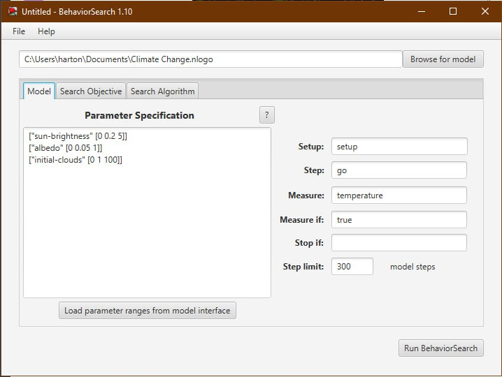

## Комп'ютерні системи імітаційного моделювання
## СПм-22-4, **Бешта Вячеслав Сергійович**

### Лабораторна робота №**3**. Використання засобів обчислювального інтелекту для оптимізації імітаційних моделей

 

### Варіант 12, модель у середовищі NetLogo:

- TODO: **Встав сюди посилання на, напевне, другу лабораторну**

 

### Налаштування середовища BehaviorSearch:

**Обрана модель**:
<pre>
C:\Users\harton\Documents\Climate Change.nlogo
</pre>

**Параметри моделі**:  
<pre>
["sun-brightness" [0 0.2 5]]
["albedo" [0 0.05 1]]
["initial-clouds" [0 1 100]]
</pre>

Використовувана **міра**:  
Для фітнес-функції було обрано **температуру**, вираз для розрахунку взято з налаштувань графіка аналізованої імітаційної моделі в середовищі NetLogo

та вказано у параметрі "Measure":
<pre>
temperature
</pre>

Температура повинна враховуватися **в середньому** за весь період симуляції тривалістю, 300 тактів , починаючи з 0 такту симуляції.  
Параметр зупинки за умовою ("**Stop if**") не використовувався. 

Загальний вигляд вкладки налаштувань параметрів моделі:   

**Налаштування цільової функції**:  
Метою підбору параметрів імітаційної моделі, що описує зміну клімату, є **максимізація** значення температури – це вказано через параметр "**Goal**" зі значенням **Maximize Fitness**.
Тобто необхідно визначити такі параметри налаштувань моделі, у яких температура є максимальною. При цьому цікавить не просто значення у якийсь окремий момент симуляції, а середнє значення за всю симуляцію. Для цього у параметрі "**Collected measure**", що визначає спосіб обліку значень обраного показника, вказано **MAEN_ACROSS_STEPS**. Симуляція буде виконуватись всього 1 раз.
Загальний вигляд вкладки налаштувань цільової функції:  

**Налаштування алгоритму пошуку** (вкладка Search Algorithm):  
Загальний вид вкладки налаштувань алгоритму пошуку:  

 

### Результати використання BehaviorSearch:
Діалогове вікно запуску пошуку:  

Результат пошуку параметрів імітаційної моделі, використовуючи **генетичний алгоритм**:  

Результат пошуку параметрів імітаційної моделі, використовуючи **випадковий пошук**:  

Генетичний алгоритм показав себе краще і видав результат, коли температура неймовірно висока. Звісно це було досягнуто за допомогою мінімізації альбедо і хмар:

 